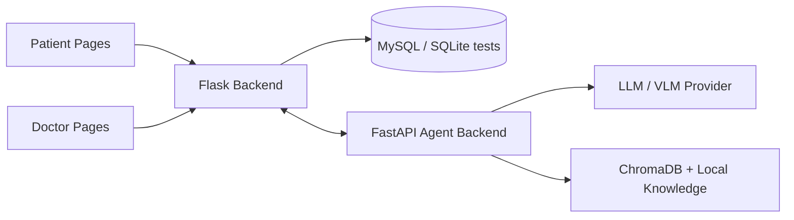

<div align="center">

# MedLink-Agent

面向患者问诊、医生工作站与结构化病历生成场景的医疗辅助原型。仓库同时包含 Flask 业务后端、静态 Web 前端，以及基于 FastAPI + AutoGen 的 Agent 服务。

<p>
  <a href="https://github.com/AusungSi/MedLink-Agent/stargazers"></a>
  
  
  
  
</p>

</div>

> [!IMPORTANT]
> 该项目更适合作为研究/课程/原型系统参考，不应直接视为生产级医疗系统，也不能替代专业医疗判断。

## Overview

`MedLink-Agent` 把一个医疗辅助应用拆成三层：

- `backend/`：Flask 业务后端，负责认证、医生/患者信息、问诊历史、病历、预约等核心业务。
- `frontend/`：静态页面，包含患者端、医生端和甲状腺工作站等交互入口。
- `agent_backend/`：FastAPI + AutoGen Agent 服务，负责结构化病历生成、影像总结、WebSocket 会话以及部分 RAG / 工具调用能力。

这套结构让仓库同时覆盖了“面向患者的医疗交互”和“面向医生的结构化辅助分析”两条链路，尤其适合展示多角色协作型医疗 AI 原型。

## What This Repo Covers

- 患者注册、登录、个人信息与历史问诊管理
- 医生注册、科室/医生列表、预约与待处理问诊流转
- AI 医疗问答、多轮问诊历史沉淀与结构化病历生成
- 甲状腺筛查表单、TI-RADS 评分链路与医生侧报告生成
- 附件上传、病历图片/报告访问与内部数据拉取接口
- 基于 AutoGen 的 Agent 会话、工具执行、RAG 与医学计算模块

## System Layout



## Repository Structure

```text
MedLink-Agent/
├── backend/                  # Flask API, models, migrations, tests
├── frontend/                 # Static patient/doctor pages
├── agent_backend/
│   ├── server.py             # FastAPI entrypoint
│   ├── services/             # Imaging and medical record workflows
│   ├── src/
│   │   ├── autogen_kernel/   # Agent orchestration
│   │   ├── tools/            # Data, web, LLM, medical calculators
│   │   └── rag_utils.py      # Local knowledge retrieval utilities
│   ├── data/                 # Sample patient/report data
│   └── autogen_compat/       # AutoGen-related compatibility deps
└── README.md
```

## Quick Start

### 1. Clone

```bash
git clone https://github.com/AusungSi/MedLink-Agent.git
cd MedLink-Agent
```

### 2. Start the Flask backend

```powershell
cd backend
python -m venv .venv
. .\.venv\Scripts\Activate.ps1
pip install -r requirements.txt

$env:FLASK_APP = "manage.py"
$env:FLASK_CONFIG = "development"
flask run --host 0.0.0.0 --port 5000
```

说明：

- 当前 `backend/app/config.py` 中的开发数据库连接是本地开发写法，运行前请替换成你自己的数据库配置。
- 测试环境使用内存 SQLite，因此接口测试不依赖 MySQL。

### 3. Start the static frontend

```powershell
cd frontend
python -m http.server 5173
```

常用页面入口：

- `http://127.0.0.1:5173/index.html`
- `http://127.0.0.1:5173/patient_index.html`
- `http://127.0.0.1:5173/doctor_index.html`
- `http://127.0.0.1:5173/doctor_thyroid_workstation.html`

### 4. Start the Agent backend

```powershell
cd ..
pip install -r agent_backend\autogen_compat\requirements.txt
pip install fastapi uvicorn pydantic requests websocket-client langchain-community
uvicorn agent_backend.server:app --host 0.0.0.0 --port 8000 --reload
```

说明：

- `agent_backend` 依赖本地知识库、向量库和模型服务；仓库没有包含完整的大模型权重与 `vector_db/` 数据。
- `agent_backend/src/config.py` 目前保留了较多本地/实验性配置，建议在你自己的环境中改成环境变量驱动。

## Key API Surface

### Flask business backend

- `POST /api/auth/register/patient`
- `POST /api/auth/register/doctor`
- `POST /api/auth/login`
- `GET /api/auth/me`
- `GET /api/doctors`
- `POST /api/appointments`
- `GET /api/history/recent`
- `POST /api/chat/medical`
- `POST /api/chat/medical/upload`
- `POST /api/chat/thyroid/screening`
- `POST /api/chat/doctor/thyroid/report`
- `POST /api/chat/medical/record`

### FastAPI agent backend

- `POST /api/v1/imaging/summary`
- `POST /api/v1/medical_record/generate`
- `POST /api/v1/chat/start`
- `WS /api/v1/chat/ws/{session_id}`

## Testing

后端接口测试位于 `backend/tests/`，可直接运行：

```powershell
cd backend
pytest
```

如果你想验证 Agent WebSocket 流程，可参考 `agent_backend/test_runner.py` 做联调。
